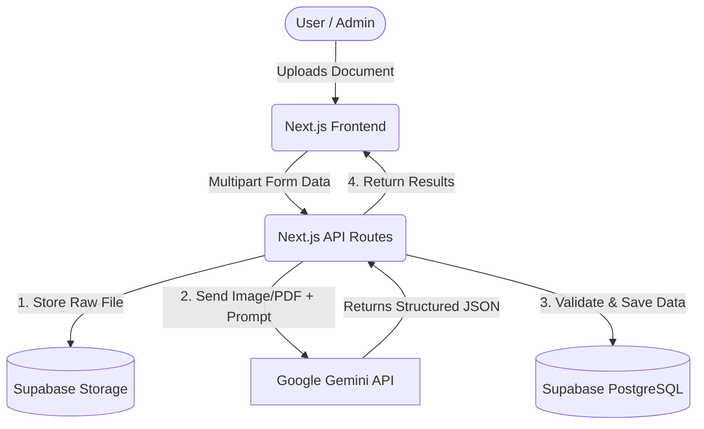

# System Architecture

This document outlines the technical architecture and data flow for the Intelligent Land Record Digitization and Validation System.

## 🏗️ High-Level Architecture

The platform is designed as a unified monolithic Next.js application, leveraging Serverless functions for the backend and Supabase for a robust, scalable database layer.

## 🧩 Components Details

### 1. Presentation Layer (Next.js Frontend)
- **Document Upload Interface:** Drag-and-drop zone for scanned PDFs and images.
- **Verification Dashboard:** A UI for human-assisted verification of low-confidence OCR results.
- **Analytics Dashboard:** Visualizes state-wise/district-wise digitization progress.

### 2. Application Layer (Next.js API Routes)
- Acts as the orchestrator.
- Securely communicates with external APIs (Gemini) so API keys are not exposed to the client.
- Handles business logic, confidence scoring thresholds, and duplicate detection.

### 3. AI / ML Layer (Google Gemini API)
- **Role:** Replaces traditional, complex OCR pipelines (like Tesseract + custom NER models).
- **Functionality:** Ingests the document image/PDF and uses a highly specific system prompt to extract land record fields natively into a structured JSON format, even from multi-lingual handwritten text.

### 4. Data Layer (Supabase)
- **Relational Database (PostgreSQL):** Stores users, roles, extracted record data, and audit trails.
- **Object Storage:** Stores the original uploaded files for future reference and verification.

## 🗄️ Database Schema Outline (PostgreSQL)

### `users`
- `id` (UUID, Primary Key)
- `email` (String)
- `role` (Enum: 'admin', 'verifier', 'viewer')

### `land_records`
- `id` (UUID, Primary Key)
- `document_url` (String, foreign key to Supabase Storage)
- `landowner_name` (String)
- `khasra_number` (String)
- `khata_number` (String)
- `plot_area` (Float)
- `village` (String)
- `tehsil` (String)
- `district` (String)
- `confidence_score` (Float, 0 to 100)
- `status` (Enum: 'pending_verification', 'verified', 'rejected')
- `created_at` (Timestamp)

### `audit_logs`
- `id` (UUID, Primary Key)
- `record_id` (UUID, Foreign Key)
- `action` (String)
- `performed_by` (UUID, Foreign Key to Users)
- `timestamp` (Timestamp)
